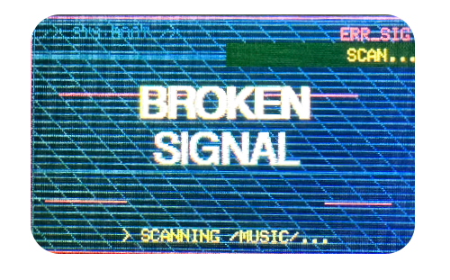
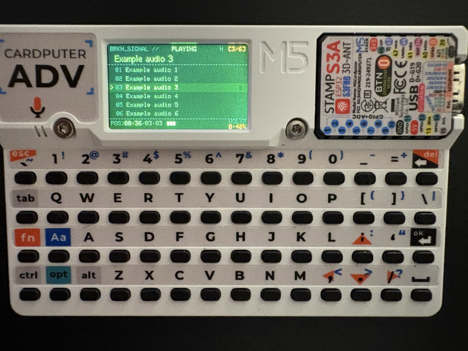
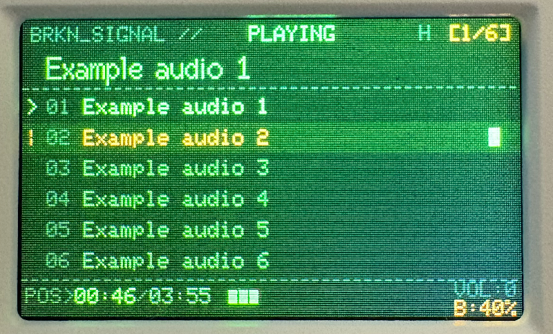
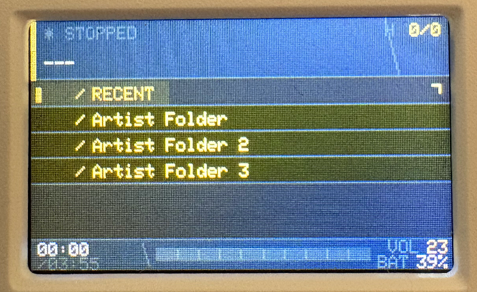
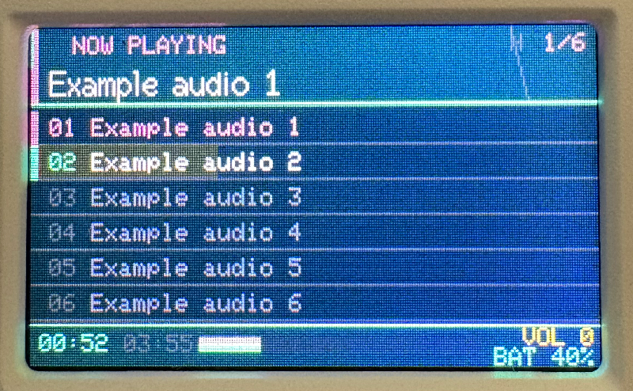

# BROKEN SIGNAL

Audio player and web radio for the **M5Stack Cardputer ADV**. Plays MP3 and M4A files with folder navigation, and streams internet radio stations (MP3) over WiFi.



---

## Features

- **Help overlay** — press H at any time, context-aware for current mode
- **MP3 and M4A (AAC-LC) playback** — native iTunes M4A support via a custom MP4 demuxer, no conversion needed
- **Web radio streaming** — press W to switch to radio mode and stream internet stations (MP3) over WiFi
- **Folder navigation** — full subfolder tree under `/Music/`, with lazy scanning so startup is instant
- **Large folder support** — folders with 200+ tracks paginated in pages of 25
- **Five themes** — switch live with keys 1–5, applied consistently across both player and radio UI
- **Repeat modes** — off / one / all
- **Shuffle**
- **Recent tracks** — virtual folder showing the last 10 played
- **Persistent settings** — theme, volume, repeat, and shuffle saved to `/Music/settings.cfg` between reboots
- **Screen off** — option to turn off display power while audio continues

---

## Themes

| Key | Name | Palette |
|-----|------|---------|
| `1` | Neon Noir | Magenta + cyan on dark background |
| `2` | Glitch Terminal | Phosphor green CRT, amber accents |
| `3` | Corpo Chrome | Gold + chrome on dark slate |
| `4` | Miami Vice | Hot pink + turquoise on dark navy |
| `5` | Ash | Monochrome white-on-black |

There are a few **screenshots** the bottom of this readme.

---

## Controls

### Music player

| Key | Action |
|-----|--------|
| `;` / `.` | Cursor up / down |
| `ENTER` | Open folder · Play track · Press again to stop |
| `DEL` | Back to parent folder |
| `SPACE` | Pause / Resume |
| `,` | Prev track (playing) · Prev page / parent folder (browsing) |
| `/` | Next track (playing) · Next page (browsing) |
| `+` / `=` | Volume up |
| `-` | Volume down |
| `R` | Cycle repeat mode (off → one → all) |
| `S` | Toggle shuffle |
| `W` | Switch to web radio mode |
| `O` | Screen on / off |
| `H` | Help overlay |
| `1`–`5` | Switch theme |

### Web radio

| Key | Action |
|-----|--------|
| `;` / `.` | Cursor up / down the station list |
| `ENTER` / `SPACE` | Play selected station · Press again to stop |
| `A` | Add station — prompts for URL then name |
| `X` | Remove selected station (with confirmation) |
| `+` / `=` | Volume up |
| `-` | Volume down |
| `W` / `DEL` | Return to music player |
| `O` | Screen on / off |
| `H` | Help overlay |
| `1`–`5` | Switch theme |

### WiFi overlay

When no saved credentials are found, a network list appears automatically.

| Key | Action |
|-----|--------|
| `;` / `.` | Scroll network list |
| `ENTER` | Select network · prompts for password |
| `DEL` | Cancel / dismiss |

---

## Hardware

- **M5Stack Cardputer ADV**
- **MicroSD card**

---

## SD Card Layout

```
SD/
└── Music/
    ├── track.mp3
    ├── track.m4a
    ├── settings.cfg           ← theme, volume, repeat, shuffle (auto-created)
    ├── _radio/
    │   ├── webradio.cfg       ← saved station list (auto-created)
    │   └── wifi.cfg           ← WiFi credentials (auto-created on first connect)
    └── Album Folder/
        ├── 01 - Track.mp3
        └── 02 - Track.m4a
```

Subfolders nest to any depth. The `_radio/` folder is automatically skipped by the music scanner. All config files are created automatically by the app; you do not need to create them manually.

---

## Installation from .bin

### M5Launcher
Download the .bin from releases, copy to your sd card and install it via [M5 Launcher](https://github.com/bmorcelli/Launcher)
Or browse the OTA repository and search for "Broken Signal"

### M5Burner
Available on M5Burner

## Build and upload via Arduino IDE

### Dependencies

Install both libraries via the Arduino Library Manager or the links below:

| Library | Source |
|---------|--------|
| M5Cardputer | https://github.com/m5stack/M5Cardputer |
| ESP8266Audio | https://github.com/earlephilhower/ESP8266Audio |

### Board setup

1. In Arduino IDE, add the ESP32 board package from Espressif
2. Select **M5Stack Cardputer** as the target board
3. Set **Partition Scheme** to one with enough app space (e.g. *Huge APP*)

### Flash

1. Clone or download this repo
2. Open `BrokenSignal.ino` in Arduino IDE
3. Connect the Cardputer via USB-C
4. Upload

---

## Screenshots






---

## Technical notes

**M4A playback** — The player includes a bespoke MP4 container demuxer (`AudioFileSourceM4A`) that parses the `moov` atom tree, extracts the AAC sample table, and streams frames with ADTS headers prepended for `AudioGeneratorAAC`. Duration reading uses an end-of-file first strategy to avoid walking the FAT chain past large `mdat` blocks.

---

## License

AI models were heavily used to create this code. You may want to hire a team of lawyers to determine what kind of licence it ends up falling under. If you do, let me know — I genuinely have no clue.

As for my personal preference: simply mention the name of this repository and link back to it if you reuse or redistribute this code.

Thanks to [earlephilhower](https://github.com/earlephilhower/ESP8266Audio/tree/master) for the audio library that made this possible.
